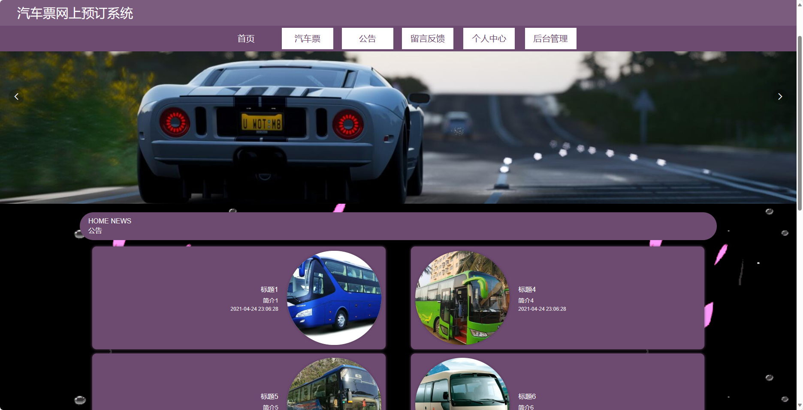
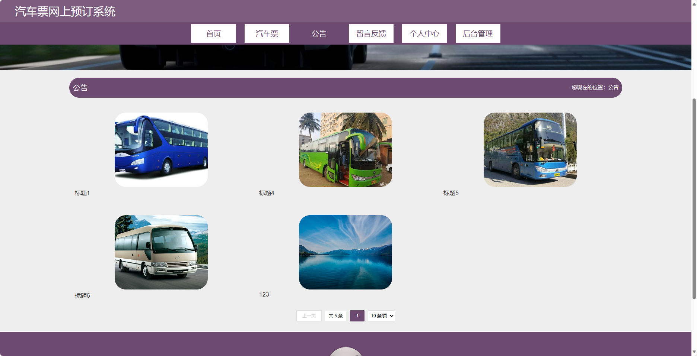
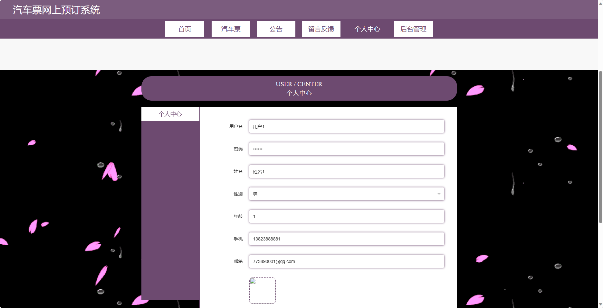
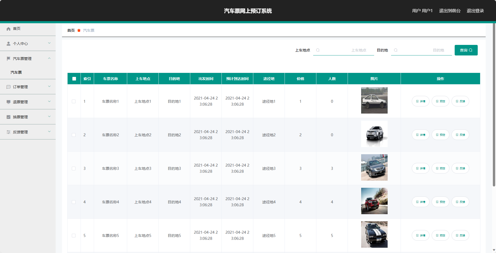

<h1 align="center">基于SpringBoot框架实现的汽车票网上预订系统</h1>

 获取sql文件 QQ: 3645296857 QQ群: 978300347 

<h4> 需要视频演示可联系上述QQ，私发视频链接 </h4>

 获取更多高质量源码，请访问：[mzoo源码网](https://mzoocodes.com/)

## 简介

> 本代码来源于网络,仅供学习参考使用!
>
> <b style="color: dodgerblue"> 提供1.远程部署/2.修改代码/3.定制程序/4.文档指导/5.框架代码讲解、技术解答、代码讲解等服务 </b>
>
> 前台地址：http://localhost:8080/springboot0t1t7/front/index.html
> 
> 后台地址：http://localhost:8080/springboot0t1t7/admin/dist/index.html
>
> 管理员: admin 密码: 123456
> 
> 用户：用户1 密码：123456
>

## 项目介绍

基于SpringBoot框架实现的汽车票网上预订系统：前端 vue、axios、elementui，后端 springboot、mybatis，系统角色分为：管理员和用户，管理员在管理后台用户信息、票务信息以及退票等；用户可以查看汽车票并对其进行购买等。主要功能如下：

## 【前台】

- 首页：展示网站信息、活动公告等。
- 汽车票：提供汽车票查询、购买、修改订单、退票、换票等功能。
- 公告：展示网站的新闻资讯、活动公告等。
- 留言反馈：用户可以留言反馈意见和建议。
- 个人中心：用户登录后可以查看个人信息、订单记录等。

## 【后台】
### 管理员

- 用户管理：管理员可以管理网站上的用户信息，包括添加、编辑、删除等操作。
- 汽车票管理：管理员可以管理网站上的汽车票信息，包括添加、编辑、删除等操作。
- 订单管理：管理员可以管理网站上的订单信息，包括查看、修改、取消等操作。
- 退票管理：管理员可以管理网站上的退票申请，包括审核、处理等操作。
- 换票管理：管理员可以管理网站上的换票申请，包括审核、处理等操作。
- 反馈管理：管理员可以查看网站上的用户反馈信息，并进行回复等操作。
- 留言板管理：管理员可以管理网站上的留言板信息，包括查看、删除等操作。
- 系统管理：管理员可以管理系统的基本配置和权限设置等。 
  
### 用户

- 汽车票管理：用户可以查看、购买、修改、退票、换票等自己的汽车票订单信- . 订单管理：用户可以查看自己的订单信息，包括历史订单和当前订单，进行修改、取消、支付等操作。
- 个人信息：用户可以修改自己的个人信息，包括联系方式、密码等。
- 反馈管理：用户可以查看自己提交的反馈信息的回复状态。

## 环境

- <b>IntelliJ IDEA 2020.3</b>

- <b>Mysql 5.7.26</b>

- <b>Maven 3.6.3</b>

- <b>JDK 1.8</b>

## 运行截图

